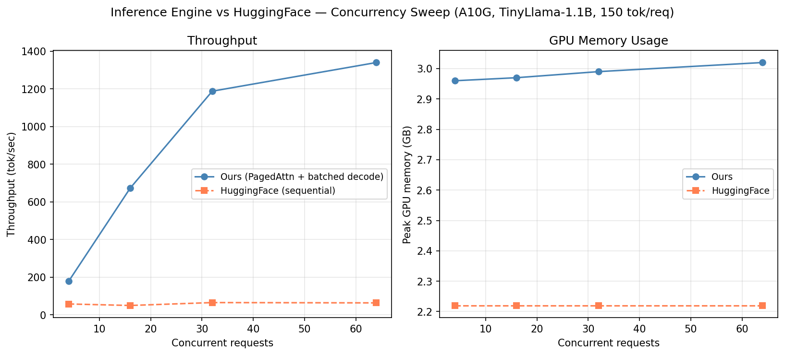

# inference-engine

A from-scratch LLM inference engine. Custom PagedAttention memory manager, continuous batching scheduler, and CUDA kernels — no vLLM, no HuggingFace inference backend.

## Results

Benchmarked on A10G (Modal), TinyLlama-1.1B, 150 tokens/request. HuggingFace baseline runs requests sequentially (no continuous batching).

| Concurrency | This engine | HuggingFace | Speedup |
|---|---|---|---|
| 1 | 56.8 tok/sec | 49.6 tok/sec | 1.1x |
| 4 | 178.0 tok/sec | 57.3 tok/sec | 3.1x |
| 16 | 672.8 tok/sec | 49.3 tok/sec | 13.6x |
| 32 | 1187.8 tok/sec | 64.7 tok/sec | 18.4x |
| 64 | **1340.1 tok/sec** | 63.1 tok/sec | **21.2x** |

**Peak GPU memory: 2.96 → 3.02 GB across 1–64 concurrent sequences** (PagedAttention allocates only what's needed — no padding, no max-length reservation).

At low concurrency the gap is small. As load increases, HuggingFace stays flat (~60 tok/sec, one request at a time) while this engine scales with the batch. The throughput curve is the point.



## What's inside

```
engine/
  block_manager.py   — PagedAttention: KV cache in fixed-size blocks, ~4% waste vs ~60% naive
  scheduler.py       — continuous batching: one forward pass per step over all running sequences
  model/             — TinyLlama transformer, RoPE, GQA, RMSNorm
  server.py          — FastAPI: /generate, /stream (SSE), /health
kernels/
  paged_attention.cu — custom CUDA kernel: gathers KV from non-contiguous blocks
benchmarks/
  run.py             — parallel benchmark vs HuggingFace
tests/
  test_kernels.py    — single + batched kernel correctness vs PyTorch reference
```

## How it works

**PagedAttention:** KV cache split into 16-token blocks. Each sequence gets a block table (logical→physical). No padding, no max-length reservation. Memory scales with actual sequence length.

**Continuous batching:** The scheduler runs a waiting queue + running set. Each token step: prefill any new sequences, then batch all decode-ready sequences into one forward pass. When a sequence finishes, the next waiting request takes its slot immediately.

**Custom CUDA kernel:** `paged_attention_decode_batched` — grid `dim3(num_heads, num_seqs)`, each block gathers KV from non-contiguous physical blocks via the block table, computes numerically-stable softmax, returns weighted V sum. Correctness tested against PyTorch reference (max diff < 0.05 in float16).

## Run

```bash
# kernel correctness + generation benchmark on Modal (A10G)
modal run modal_generate.py

# throughput benchmark vs HuggingFace
modal run benchmarks/run.py
```

## Stack

Python · PyTorch · CUDA C++ · pybind11 · FastAPI · Modal
